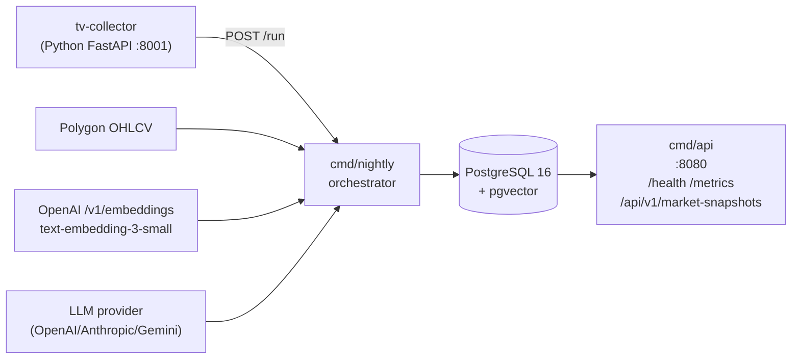

# Lattice Momentum — a Minimal LLM Evaluation Pipeline for Financial Research

> **Disclaimer:** Educational project. Not investment advice. No live trading, no order routing, no broker integration — backward-looking paper attribution only.

A focused subset of the larger Momentum AI platform I built and operate personally. Here narrowed down to a **single momentum ranking pipeline** and the full LLM-evaluation / RAG / self-improvement stack around it. The project investigates one question with real outcomes rather than assumption:

> Does the LLM's qualitative judgment add measurable, statistically testable value over the quantitative ranking engine alone?

The system computes per-ticker recommended-vs-rejected attribution, replays actual forward OHLC paths for stop/target detection, and stores verified outcomes that feed both A/B prompt experiments and a pgvector-backed RAG memory.

## What this demonstrates (and what it does not)

| AI engineering capability | Where to look | Notes |
|---|---|---|
| Multi-provider LLM abstraction (raw HTTP, no SDKs) | `internal/llm/{provider,client,openai,anthropic,gemini,models}.go` | OpenAI, Anthropic, Gemini via `net/http`; metrics emitted per call. |
| Anthropic prompt caching (`cache_control: ephemeral` + `anthropic-beta: prompt-caching-2024-07-31`) | `internal/llm/anthropic.go` | Only Anthropic provider supports caching and SSE streaming. |
| Structured output parsing | `internal/services/llm/momentum_parser.go`, `internal/services/llm/response_parser.go` | **Primary**: JSON contract parser (`json-v1`) extracts a MANDATORY OUTPUT CONTRACT JSON block. **Fallback**: regex table→block→merge engine (`regex-v1`) handles responses lacking a JSON block. |
| Ticker-blind scoring (anonymize → score → de-anonymize) | `internal/services/llm/prompt_renderer.go` | `STOCK_A`, `STOCK_B`, ...; resolves back via `DeAnonymizeResponse`. |
| Prompt versioning via content hash | `ComputePromptVersionHash` in `prompt_renderer.go` | Format `v7-<8-char SHA-256>`. |
| RAG (pgvector + OpenAI `text-embedding-3-small`) | `services/llm/embedding_service.go`, `services/llm/prompt_renderer.go`, `repository/prompt_memory_repo.go` | `{{rag_context}}` placeholder injected in `renderUserPrompt`; verified-only retrieval (`WHERE outcome_status = 'verified'`). |
| A/B prompt variant storage | `internal/models/prompt_variant.go`, `internal/repository/prompt_variant_repo.go`, migration 032 | `EvaluateListWithVariant` exists in `evaluation_service.go` but is **NOT wired** into `cmd/nightly/main.go`. Promote path is structurally blocked by a `variantActivator` interface vs `PromptVariantRepo` signature mismatch. |
| Two-proportion z-test on prompt versions | `internal/jobs/nightly_prompt_experiment_job.go::RunPromptABSignificanceTest` | Runs nightly; p < 0.05 flags challenger as promotion candidate (log-only; no activator wired). |
| Per-ticker outcome attribution with path-aware OHLC replay | `internal/jobs/prompt_outcome_attribution_job.go`, `internal/services/outcomes/exit_simulator.go` | 30-day lookback; stop-priority on whipsaw days; `actual_rr_achieved = (exit - entry) / (entry - stop)`. |
| Guardrails: R/R floors, disqualification, plausibility quarantine | `outcomes.ValidateLevels`, `outcomes.TradeOutcomeService.PlausibilityCheck`, `models.EvaluationParsedTicker.Disqualified` | Thresholds cap 1D return ≤75% and 20D return in [-70%, +200%]; parser flags `Disqualified=true` on conviction `DISQUALIFIED` or `disqualifier_reason:` line. |
| Regime classification with EMA smoothing + drawdown cap + R-02 signals | `internal/services/regime/classifier.go`, `internal/services/market_inputs_service.go` | 12-pt scoring, VIX/TICK/breadth-velocity enrichment, velocity-bypass smoothing, `-20% / -30%` SPY drawdown caps regime at `correction` / `bear`. |
| Sector momentum scoring | `internal/services/sector/sector_momentum_service.go` | Cross-section percentile ranking; 5-label output `LEADING/STRONG/NEUTRAL/WEAK/LAGGING`. |
| DB-backed ranking weights | `internal/services/ranking/momentum_engine.go` via `MomentumWeightsProvider` | Loads from `momentum_score_weights` table at startup; falls back to hardcoded defaults on DB error. |
| Net-of-cost returns + regime segmentation (R-06) | `internal/jobs/net_return_job.go`, migrations 062 + 064 | Slippage tiers, ADV caps, `regime_bucket` GENERATED column (`risk_on`/`risk_off`). |

**Not in this subset (and disclosed openly):**

- **React dashboard** — the static-file handler in `cmd/api/main.go` is commented out; no `web/` directory is shipped. API-only deployment.
- **Circuit-breaker wire-up** — the full `full` / `ep_only` / `halt` gate logic (`CircuitBreaker.Evaluate`) is operational in the production system and wired into the live cron. In this public subset the wiring is intentionally stripped for simplicity; the file is retained as a reference implementation, so `CircuitBreaker.Evaluate` is not invoked by `cmd/nightly/main.go`, and the persisted `gate_level` column the pipeline would normally read is not written by any code path in the subset. In practice `gateLevel` defaults to `"full"` and downstream steps execute unconditionally.
- **HNSW index on `prompt_memory`** — the production system uses an HNSW index (the originally-planned migration 053). In this subset HNSW is intentionally removed for simplicity; migration 053 is not in the subset's codebase, so the `ivfflat` index from migration 033 (`lists=10`) is the only vector index present.
- **A/B auto-promotion** — see below. Log-only in the subset; wired in production.
- **EP and Leaders ranking engines**, intraday candle ingestion, EDGAR, options flow, narrative velocity (job), follow-through microstructure, pre-market surge scanner (Epic 13), XGBoost/LightGBM weight refit (R-12 / `scripts/train_premonition.py`).

## Architecture overview
Single Go module (`ai-stock-service`) backed by one PostgreSQL 16 + pgvector instance. Five Docker services: `postgres`, `api` (HTTP :8080), `scheduler` (cron → `cmd/nightly`), `backfill` (one-shot, profile-gated), and `tv-collector` (Python FastAPI). Three Go binaries built: `cmd/api`, `cmd/nightly`, `cmd/backfill`.



<details>
<summary><b>Full component diagram (technical reviewers)</b></summary>




</details>

```mermaid 
flowchart TD
%% External inputs
TVCollector["tv-collector\nPython FastAPI\nPOST /run"]
Polygon["Polygon.io / Massive.com / TwelveData"]
OpenAISvc["OpenAI API\ntext-embedding-3-small\n1536-dim vectors"]
LangModel["LLM Provider\n(OpenAI / Anthropic / Gemini)\nRaw HTTP, no SDKs"]

%% Data layer
PostgreSQL[("PostgreSQL 16 + pgvector")]
PromptMemory[("prompt_memory\nvector(1536) ivfflat\n(lists=10) cosine")]
PromptVariants[("prompt_variants\nA/B test templates")]
PTO[("prompt_ticker_outcomes\nrecommended vs rejected")]
OtherTables[("daily_rank_lists,\nllm_list_evaluations,\ntrade_outcomes_daily (+R-06 net cols),\ncommercial_reports,\nprompt_experiment_results,\nmarket_regime_daily,\nsector_scores_daily,\ncandle_daily, tickers")]

PostgreSQL --- PromptMemory & PromptVariants & PTO & OtherTables

%% Config & DB
Config["internal/config/config.go\nall features default off\nLLMConfig() / CommercialLLMConfig()"]
PostgresDB["internal/db/postgres.go\npgxpool + goose migrations"]
Migrations["internal/db/migrations\nSubset (non-contiguous — see README):\n001–021 core\n031–033 AI\n062, 064 net-of-cost returns (R-06)\nProd: goose auto-increment on main"]

Config -->|Load| CmdNightly["cmd/nightly\n12-15 feature-gated steps\n+ post-drain steps"]
Config --> CmdAPI["cmd/api\nHTTP :8080\n(no static frontend in subset)"]
PostgresDB --> PostgreSQL
Migrations --> PostgreSQL

%% Market inputs / regime / sector / ranking
MarketInputsSvc["services/market_inputs_service.go\nBuildMarketInputs\nSMA, breadth, RS, drawdown,\nVIX level+ROC, $TICK low, breadth velocity\n200-bar minimum guard"]
RegimeClassifier["services/regime/classifier.go\n12-pt scoring + EMA(α=0.5)\nvelocity-bypass fast path\n5 regime labels\ndrawdown cap: -20% → correction, -30% → bear"]
SectorMomSvc["services/sector/sector_momentum_service.go\ncross-section percentile ranking\n5 labels LEADING/STRONG/NEUTRAL/WEAK/LAGGING"]
MomentumEngine["services/ranking/momentum_engine.go + shared.go\nDB-backed weights (MomentumWeightsProvider)\nregime & sector multipliers\nTop 10 tickers"]

CmdNightly --> MarketInputsSvc --> PostgreSQL
CmdNightly --> RegimeClassifier --> PostgreSQL
CmdNightly --> SectorMomSvc --> PostgreSQL
CmdNightly --> MomentumEngine --> PostgreSQL
CmdNightly --> UniverseSnap["universe_snapshot_job (R-04)"] --> PostgreSQL
CmdNightly --> CorpAction["corporate_action_job\nnon-fatal — split/reverse-split adjustment"] --> PostgreSQL

%% LLM layer
LLMProvider["internal/llm/provider.go\nProvider interface\nGenerate(ctx, *Request) (Response, error)"]
LLMClient["internal/llm/client.go\nNewProvider factory\nreturns error on empty API key"]
OpenAI["internal/llm/openai.go\ngpt-4.1-mini\nPOST /v1/responses"]
Anthropic["internal/llm/anthropic.go\nclaude-sonnet-4-6\nanthropic-beta: prompt-caching-2024-07-31\nSSE: message_start/content_block_delta/message_delta"]
Gemini["internal/llm/gemini.go\ngemini-2.5-flash\nPOST :generateContent?key="]

LLMClient --> LLMProvider
LLMProvider --> OpenAI & Anthropic & Gemini

EvaluationSvc["services/llm/evaluation_service.go\nEvaluateList + EvaluateListWithVariant (unwired in subset)\n1 inline retry, 5s backoff\nMaxTokens = min(len(tickers)*1400, cfg.LLMMaxTokens=8000)"]
PromptRenderer["services/llm/prompt_renderer.go\nComputePromptVersionHash\nbuildTickerMapping / DeAnonymizeResponse\n{{rag_context}} injection"]
ResponseParser["services/llm/response_parser.go\nregex-v1: 2-pass (table → blocks) + merge\nDisqualified flag extraction"]
MomentumParser["services/llm/momentum_parser.go\njson-v1: MANDATORY OUTPUT CONTRACT\nvalidates stop, entry, stop_anchor"]
EmbeddingSvc["services/llm/embedding_service.go\nEmbed(ctx, text) → pgvector.Vector\n30s timeout, /v1/embeddings"]
PromptMemoryRAG["services/llm/prompt_memory_rag_service.go\nFindAnalogousSetups\ncosine similarity over verified memories"]
CommercialSvc["services/llm/commercial_report_service.go\nJSON contract output (7 keys)\nhalt-mode cash-preservation contract"]
CommercialPrompt["services/llm/prompts/commercial_report_prompt.md\nbranded 'Alpha Engine'"]

EvaluationSvc --> PromptRenderer & ResponseParser & MomentumParser & LLMProvider & PromptMemoryRAG
PromptMemoryRAG -->|query vectors| PromptMemory
EmbeddingSvc --> PromptMemoryRAG & MemoryJob
MemoryJob["jobs/prompt_memory_job.go\nStoreMemories (writes 'pending')\n+ UpdateOutcomes (flips to 'verified')\n5-day threshold"]
EmbeddingSvc -->|vector upsert| PromptMemory
MemoryJob --> PromptMemory
CommercialSvc --> LLMProvider & CommercialPrompt

%% Trade outcomes & attribution & net returns
TradeOutcomeSvc["services/outcomes/trade_outcome_service.go\nforward 1/3/5/10/20d returns\nentry = T+1 Open\ncorporate-action adjusted\nplausibility quarantine 75/200/-70"]
ExitSim["services/outcomes/exit_simulator.go\nMaxExitDays=20\nstop-priority on whipsaw\nentry = midpoint of LLM entry zone\ntime exit = 20D close"]
NetReturnJob["jobs/net_return_job.go\nslippage tiers, ADV cap\nregime_bucket GENERATED"]
OutcomeAttributionJob["jobs/prompt_outcome_attribution_job.go\n30-day lookback\nRECOMMENDED vs REJECTED\ncopies outcomes from trade_outcomes_daily\npath-aware replay for recommended only"]

CmdNightly --> TradeOutcomeSvc --> PostgreSQL
CmdNightly --> NetReturnJob --> PostgreSQL
CmdNightly --> OutcomeAttributionJob --> PTO

%% Self-improvement loop (analytics half)
NightlyExperimentJob["jobs/nightly_prompt_experiment_job.go\nRunNightlyPromptExperimentJob (per-version metrics)\nRunPromptABSignificanceTest (two-proportion z-test, two-tailed)\nvariantActivator interface NOT wired in subset — log-only promotion flags\nWired + active in production"]

PTO --> NightlyExperimentJob --> OtherTables

%% API
APIHandler["internal/api/handler.go\nPOST /api/v1/market-snapshots only\nreport_handler.go and chart_handler.go exist but unregistered in subset"]
Auth["internal/api/auth.go\nKeyMiddleware\nX-API-Key OR Bearer, constant-time\n/health and /api/v1/config exempt"]
CORS["internal/api/cors.go"]
Browser["Client"] -->|HTTP| CmdAPI
CmdAPI --> CORS --> Auth --> APIHandler
APIHandler --> PostgreSQL
CmdAPI -.->|"// mux.Handle('/', http.FileServer(http.Dir(web/dist))) is commented out"| ReactFE["React frontend\nNOT shipped in subset"]

%% Circuit breaker (intentionally inert in subset; wired in prod)
CircuitBreaker["internal/services/regime/circuit_breaker.go\nGateFull/GateEPOnly/GateHalt\nSubset decision: wiring stripped for simplicity\nNOT invoked by cmd/nightly in the subset\nIn prod it's wired and writes gate_level\nIn subset gateLevel defaults to 'full'"]
CircuitBreaker -.-> CmdNightly```
```

## Pipeline structure
```
Single pipeline (Momentum) → Single Go module (ai-stock-service)
├── TradingView screener imports (POST /run → tv-collector)
├── Corporate action fetch (non-fatal, split/reverse-split adjustment)
├── Universe snapshot (R-04, survivorship quantification)
├── Market regime inputs (SMA, breadth, RS, drawdown, VIX, $TICK, breadth velocity)
├── Market regime classification (12-pt + EMA + velocity-bypass + drawdown cap)
├── Sector momentum scoring (5-label)
├── Daily ranking lists (Momentum only — EP/Leaders out of scope)
├── LLM list evaluation (feature-gated: LLM_EVAL_ENABLED)
│   ├── Multi-provider (OpenAI / Anthropic / Gemini), raw HTTP, no SDKs
│   ├── Anthropic prompt caching (cache_control: ephemeral + SSE streaming)
│   ├── Ticker anonymization / de-anonymization (STOCK_A, STOCK_B, ...)
│   ├── Structured output parsing (json-v1 primary; regex-v1 fallback)
│   ├── Prompt versioning (SHA-256 content hash → v7-XXXXXXXX)
│   └── RAG (pgvector + OpenAI text-embedding-3-small; {{rag_context}} injection)
├── Trade outcome calculation + corporate-action-adjusted forward returns
├── Net-of-cost returns (R-06: slippage tiers, ADV caps, regime segmentation)
├── Commercial report transformation (feature-gated: COMMERCIAL_REPORT_ENABLED)
├── A/B prompt experiment tracking (two-proportion z-test; log-only promotion flags)
├── Per-ticker outcome attribution (30-day lookback, path-aware OHLC replay)
└── Prompt memory outcome update (feature-gated: PROMPT_MEMORY_ENABLED; 5-day verification)
```

## Technical decisions

**Why Go?** Single-binary deployment per service, fast cold-start for cron jobs, native concurrency for the parallel LLM evaluation step, and strong typing catches schema mismatches at compile time — critical when parsing unstructured LLM output into structured trade records.

**Why raw HTTP over SDKs?** SDKs abstract away the headers and fields we need: Anthropic's `cache_control: ephemeral` system-block variant, the `anthropic-beta: prompt-caching-2024-07-31` header, SSE event semantics (`message_start` / `content_block_delta` / `message_delta`), and the per-call `cache_read_input_tokens` / `cache_creation_input_tokens` accounting. `internal/llm/{openai,anthropic,gemini}.go` use bare `net/http` with no SDK imports.

**Why pgvector over a separate vector store?** Prompt memory needs semantic similarity search over verified setups colocated with the relational outcome tables that validate them. pgvector also makes the "verified-only retrieval" guardrail a single SQL predicate: `WHERE outcome_status = 'verified'`. Migration 033 uses `ivfflat (embedding vector_cosine_ops) WITH (lists = 10)` — no HNSW migration is applied in this subset (HNSW is in production via migration 053; intentionally removed from the subset for simplicity).

**Why a JSON-contract parser with a regex fallback?** The momentum prompt ends with a MANDATORY OUTPUT CONTRACT JSON block. `ParseMomentumResponse` (parser version `json-v1`) extracts it via two strategies: fenced ` ```json ` blocks first, then brace-depth counting from the "MANDATORY OUTPUT CONTRACT" header. `ParseEvaluationResponse` (parser version `regex-v1`) is the fallback for older responses lacking a JSON block — it runs a 2-pass markdown-table + detailed-blocks scan and merges the results (block data preferred; table fills gaps).

## LLM system design

**Prompt pipeline.** Templates live as `.md` files (`services/llm/prompts/*.md`) embedded via `//go:embed`, so the system prompt is byte-stable across calls — required for Anthropic's cache to hit. `PromptRenderer.ComputePromptVersionHash` produces a deterministic version string `v7-XXXXXXXX` (base version + first 8 chars of SHA-256 of system+user content), making prompt-variant tracking automatic and skipping manual version bumps. Tickers are anonymized (`STOCK_A`, `STOCK_B`, ...) before the LLM call and de-anonymized via `DeAnonymizeResponse` after parsing, to suppress name bias.

**Eval harness.** `EvaluationService.EvaluateList` sends the rendered prompt to any configured provider via the `Provider` interface, with one inline retry and 5s backoff. `MaxTokens` is scaled per evaluation: `min(max(len(tickers) * 1400, 4000), cfg.LLMMaxTokens)`. The response is parsed via the JSON-contract parser first, falling back to regex-v1 if no JSON block is found. Parsed results upsert into `prompt_ticker_outcomes` keyed by prompt version hash.

**A/B testing — partial (by design, in this subset).** `prompt_variants` (migration 032) stores alternate system/user templates, `EvaluateListWithVariant` is implemented in `evaluation_service.go`, and in the production system the full promotion path is wired: the variant activator invokes the production `PromptVariantRepo` to swap the active variant based on significance-test results. In this public subset the promotion path is intentionally not wired — the `variantActivator` interface in `nightly_prompt_experiment_job.go` (`UpsertVariant(ctx, version string, active bool) error`) does not match the subset's `PromptVariantRepo` implementation (`UpsertVariant(ctx, *models.PromptVariant) error`), and the activator is left nil in `cmd/nightly/main.go` — so even if `EvaluateListWithVariant` were invoked, the interface/repo signature mismatch would block compilation. The analytics half *is* wired: `NightlyPromptExperimentJob.RunNightlyPromptExperimentJob` aggregates per-version win rates (filtering to picks with ≥5 evaluated days), and `RunPromptABSignificanceTest` runs a two-tailed two-proportion z-test at p < 0.05 to flag statistically significant shadow variants. Promotion is therefore log-only in the subset; a refactor is required before promotion can take effect in the subset, by design.

**Self-improvement loop — attribution.** `OutcomeAttributionJob` iterates the past 30 days of LLM evaluations. For every input ticker it upserts a `prompt_ticker_outcomes` row with `llm_recommended = true` (if the LLM picked it) or `false` (if rejected). Forward-return fields (`actual_return_5d/10d/20d`, `actual_max_runup`, `actual_max_drawdown`, `actual_entry_price`, `evaluated_days`) are **copied** from `trade_outcomes_daily` for both classes. For recommended tickers with stop/target levels, `outcomes.ReplayExitSequence` runs a path-aware OHLC replay (T+1..T+20, stop-priority on whipsaw days) and computes `actual_rr_achieved = (exit - entry) / (entry - stop)` — note that `entry` here is the **midpoint of the LLM's recommended entry zone**, which is a different convention from the `trade_outcome_service.go` gross-returns entry (T+1 Open). The README discloses this tension: gross-return accounting uses T+1 Open; R/R replay uses the recommended entry midpoint (the right choice for "was the LLM right about the levels?").

**Self-improvement loop — RAG.** Verified memories (`outcome_status = 'verified'`) are stored in `prompt_memory` after the 5-day attribution threshold. Retrieval uses `pgvector` cosine distance (`ORDER BY embedding <=> $2 LIMIT $topK`), filtered by `list_type`, `outcome_status = 'verified'`, optional ticker exclusion, and `date >= NOW() - make_interval(days => maxAgeDays)`. Retrieved analogues are formatted by `buildRAGContextString` into a `## PAST SIMILAR EVALUATIONS (RAG context)` block injected via the `{{rag_context}}` placeholder inside `renderUserPrompt`. (The original architecture doc also referenced `{{RAG_ANALOGUES}}` in a separate `prompt_injector.go`; that file is **not in this subset** and the active injection uses `{{rag_context}}`.)

**Guardrails.** R/R floors enforced at write time via `outcomes.ValidateLevels` (EP ≥ 2.5:1, Momentum/Leaders ≥ 3.0:1); violations set `levels_invalid = true`. The regex parser sets `Disqualified = true` when conviction contains `DISQUALIFIED` or when a `disqualifier_reason:` line is present. Implausible forward returns are quarantined (1D abs ≤75%, 20D ≤200%, 20D ≥ -70%). Corporate-action adjustments divide raw return by split ratio (forward splits) or multiply by ratio (reverse splits) when `adjusted_close` is null. Missing data in the prompt is rendered as `[DATA MISSING]` rather than allowing the LLM to invent levels.

**Regime classification.** 12-point scoring across SMA distance (5 pts SPY+QQQ), golden cross (1 pt), distribution days (1.5 pts), market breadth (1.5 pts), RS ratios (1 pt), VIX (1 pt), NYSE $TICK (0.5 pt), breadth velocity (0.5 pt). EMA smoothing with α = 0.5 (half-life ≈ 1 session) plus a velocity bypass: a single-session drop in raw bull strength > 0.25 disables smoothing to detect crashes immediately. Drawdown caps force regime ≤ `correction` when SPY is below -20% from 52-week high and ≤ `bear` when below -30%. Missing VIX/TICK data degrades to neutral (0.5 / 0.25 respectively) rather than mis-classifying. A 200-bar minimum guard at `BuildMarketInputs` returns an error if SPY/QQQ/IWM history is insufficient.

**Circuit breaker (disclosed: intentionally inert in this subset).** In the production system, `internal/services/regime/circuit_breaker.go` defines a `GateFull` / `GateEPOnly` / `GateHalt` policy (correction + VIX < 28 → ep_only; correction + VIX ≥ 28 → halt; bear → halt) and `CircuitBreaker.Evaluate` is invoked from the nightly orchestrator, with `gate_level` written to the `market_regime` table. In this public subset that wiring is intentionally removed for simplicity: `CircuitBreaker.Evaluate` is **not invoked** by `cmd/nightly/main.go`, and neither `UpsertMarketRegimeDaily` nor `UpsertMarketRegime` writes a `gate_level` column. The pipeline reads `regime.GateLevel` from the legacy `market_regime` table via `MarketRegimeRepo.GetByDate`, and in practice `gateLevel` defaults to `"full"`, so downstream steps execute unconditionally. The file is retained as a reference implementation of the gate policy.

## Observability

- `log/slog` structured JSON logging on every job with fields `job`, `date`, `step`, `duration_ms`, and computed metric values.
- Prometheus client via `promauto`. `/metrics` served **on the API port (8080)** alongside `/health` (the README's previous "off the main API port" claim was wrong; verified in `cmd/api/main.go`).
- Token accounting per LLM call: `InputTokens`, `OutputTokens`, `CacheReadTokens` (Anthropic only), `CacheCreationTokens` (Anthropic only). Surfaced as Prometheus metrics `llm_tokens_used_total{provider,model,kind,listType}` and `llm_tokens_cached_total`.
- `nightly_runs` audit table records `status`, `steps_total`, `steps_completed`, `failed_step`, `step_durations` (JSONB), `duration_ms`.
- Per-call `LLMRequestsTotal`, `LLMRequestDuration` histograms.

## Performance and cost

The numbers below are **per-LLM-evaluation-call measurements** from the production deployment's `llm_list_evaluations` table. The full production system runs three ranking engines (EP, Momentum, Leaders); this subset retains only Momentum, so only the momentum-row figure is representative of what this subset's nightly LLM call produces. EP and Leaders rows are shown for context.

| Engine (LLM eval call) | Input tokens | Output tokens | Wall-clock (ms) |
|---|---|---|---|
| ep                | 5,736  | 1,331 | 17,325 |
| momentum (subset) | 12,964 | 4,642 | 72,347 |
| leaders           | 14,600 | 4,952 | 75,852 |

In the most recent nightly production stack ran (00:35–00:40 CEST, Jul 17) on OpenAI `gpt-4.1-mini-2025-04-14`: 2 calls, 29,402 input tokens, 10,234 output tokens, est. cost $0.028, P99 latency 30 s, avg latency 74.1 s.

Per-run LLM cost depends on provider and cache hit rate. With Anthropic prompt caching enabled, the ~8–10k-token system prompt is billed once per 5-minute cache window; subsequent calls bill only the dynamic user tokens plus output tokens. Cold-start (no cache hit) bills the full system prompt every call. Inspect the per-call `CacheReadTokens` and `CacheCreationTokens` fields in `prompt_experiment_results` and the `llm_tokens_cached_total` Prometheus metric for actual figures from your own runs.

## Running it

**Prerequisites:**

- Docker and Docker Compose
- A Polygon.io API key (or TwelveData as the alternative provider)
- An OpenAI, Anthropic, or Gemini API key (only required to actually exercise the LLM features)

**Steps:**


```bash
1. Configure secrets
   cp .env.example .env
   Fill in: DATABASE_URL, POLYGON_API_KEY, and (for LLM activation) LLM_PROVIDER
   plus the matching LLM_*_API_KEY. Feature flags default off (verified in config.go):
   LLM_EVAL_ENABLED, COMMERCIAL_REPORT_ENABLED, PROMPT_MEMORY_ENABLED, RAG_ENABLED
   With all flags off, only the quantitative ranking engine runs (no LLM calls).
2. Bring up the stack (5 services: postgres, api, scheduler, tv-collector; backfill is profile-gated)
   docker compose up --build
3. Wait for migrations, then sanity-check the API
   curl -s localhost:8080/health
   Expected: HTTP 200 with body {"status":"ok"}
4. Trigger the nightly pipeline manually (it lives in the SCHEDULER service, not api)
   docker compose exec scheduler /nightly
5. Run a one-shot historical candle backfill when needed (takes a 2-year window)
   docker compose --profile backfill run --rm backfill```

Optional feature flags to enable the AI half of the pipeline (all default `false` in `internal/config/config.go`):

- `LLM_EVAL_ENABLED=true` — activates Step 9 (LLM list evaluation with prompt caching, structured parsing, RAG injection)
- `COMMERCIAL_REPORT_ENABLED=true` — activates Step 12 (LLM commercial report transformer)
- `PROMPT_MEMORY_ENABLED=true` — activates the prompt memory outcome-verification post-step
- `RAG_ENABLED=true` — activates the `{{rag_context}}` analogue injection in evaluations (requires `EMBEDDING_BACKEND=openai` and `OPENAI_API_KEY` or `EMBEDDING_ENDPOINT_URL`)

## Routes actually registered by `cmd/api`

| Method | Path | Notes |
|---|---|---|
| `GET`  | `/health` | DB ping; intentionally unauthenticated. |
| `GET`  | `/metrics` | Prometheus scrape (on port 8080). |
| `GET`  | `/api/v1/config` | Public — returns `{"apiKey": "<API_KEY>"}` so an embedded frontend could bootstrap without baking in the key. |
| `POST` | `/api/v1/market-snapshots` | Receives tv-collector payloads (10 MB max body); upserts tickers and TV snapshot rows. |

`report_handler.go`, `chart_handler.go`, and `rank_list_handler.go` files exist in `internal/api/` but are **not registered** in `cmd/api/main.go` — they require `WithCharts` / `WithRankLists` fluents which are not currently called. Their routes are preserved for production deployment.

Auth: `KeyMiddleware` accepts either `X-API-Key` header (preferred per code comment — avoids nginx basic-auth conflict) or `Authorization: Bearer <key>`. Constant-time comparison. When `API_KEY` is unset, middleware becomes a no-op and logs a startup warning. `/health` and `/api/v1/config` are intentionally exempt.

## Subset vs. production — at a glance

| Subsystem | In production | In this subset | Reason for removal |
|---|---|---|---|
| Circuit breaker (gate logic) | Wired; `Evaluate` invoked nightly; `gate_level` written to `market_regime` | File retained, `Evaluate` not invoked; `gateLevel` defaults to `"full"` | Simplify public subset |
| HNSW index on `prompt_memory` | Active (migration 053) | `ivfflat (lists=10)` only | Simplify public subset |
| A/B variant auto-promotion | Wired; `variantActivator` invokes production `PromptVariantRepo` | Analytics runs; activator interface/repo signature mismatch; log-only flags | Simplify public subset |
| EP and Leaders ranking engines | Active | Not compiled into subset | Scope: focus on Momentum only |
| XGBoost/LightGBM refit sidecar | Active (R-12; SHAP + AUC gating) | Script retained, not invoked | Scope: focus on LLM eval half |
| React dashboard | Served from `cmd/api` | `http.FileServer` commented out; no `web/` shipped | Simplify public subset |
| Migration numbering | Sequential auto-increment on main | Non-contiguous ranges: `001–021`, `031–033`, `062`, `064` | Subset carved from prod history |

## Scope and design decisions (continued)

Excluded from this subset, explicitly, with the rationale noted:

- The pre-market catalyst surge scanner (Epic 13)
- The EP and Leaders ranking engines (the package doc-comment in `internal/services/ranking/shared.go` claims three engines; only `MomentumEngine` satisfies the `Engine` interface assertion — the legacy comment is stale and will be cleaned up in the public subset)
- Intraday candle ingestion, EDGAR 8-K ingestion, options flow, follow-through microstructure
- The XGBoost/LightGBM weight-refit sidecar (`scripts/train_premonition.py`) — retained in the repo for reference but not invoked by the subset pipeline
- A React dashboard — the `http.FileServer` handler in `cmd/api/main.go` is commented out and no `web/` directory is shipped
- An HNSW index on `prompt_memory` — present in production (migration 053); intentionally removed from the subset, so `ivfflat` is the only vector index here
- A live circuit breaker — present and wired in production; intentionally stripped from the subset's nightly pipeline (see Guardrails section above)
- Auto-promotion of A/B winners — present and wired in production; intentionally not wired in the subset (see A/B testing section above)

The full production system includes a self-improving XGBoost/LightGBM refit with SHAP explainability and an AUC-gated deployment check (R-12). Source architecture documentation available on request.

> **Note on migration numbering.** In the production system, migration filenames are auto-incremented by `goose` as features merge — a migration added for net-of-cost returns (R-06) on the main branch becomes `062_*.sql`, a follow-on `064_*.sql`, and so on. Because this README describes a **focused subset** carved out of that history rather than a fresh project, the subset's migration files are not contiguous: the core range is `001–021`, the AI range is `031–033`, and the net-of-cost returns range is `062`, `064`. Gaps in the sequence are expected and reflect migrations that belong to engines and features excluded from this subset (EP, Leaders, EDGAR, options flow, intraday ingestion, HNSW, circuit-breaker wiring, etc.), not missing work.

> **Scope discipline for contributors.** If a subsystem (circuit breaker, HNSW, A/B activator, EP/Leaders engine, XGBoost refit, React dashboard) is listed as excluded from this subset, do not add it back without first updating the corresponding disclosure in this README, the architecture diagram node labels, and the migration range note above. Each "intentionally removed" disclosure currently acts as the README's credibility currency — the architectural review test is "does the README honestly describe what's actually in the repo." Adding code without updating the matching disclosure invalidates that test, by design.
